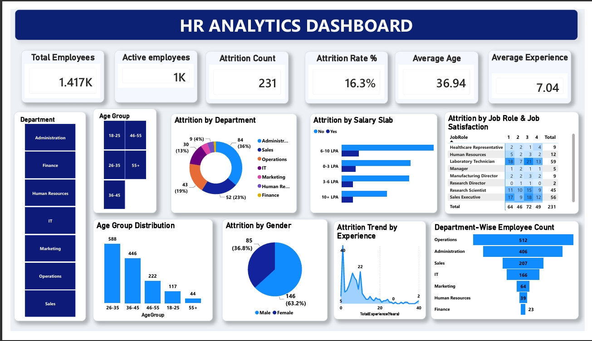

# HR Analytics Dashboard | Power BI

<p align="center">
  
</p>

##  Project Overview

This project presents an interactive **HR Analytics Dashboard** developed using **Microsoft Power BI** to analyze employee demographics, workforce distribution, employee attrition, and job satisfaction.

The dashboard provides HR professionals with key insights into workforce trends, helping identify areas with high employee turnover and supporting data-driven decision-making.

---

##  Objectives

- Analyze employee attrition across departments.
- Understand workforce demographics.
- Explore employee distribution by age and experience.
- Identify salary ranges with the highest attrition.
- Compare job satisfaction across different job roles.
- Build an interactive HR dashboard for business reporting.

---

##  Dashboard Preview

<p align="center">
  
</p>


---

##  Dashboard KPIs

The dashboard provides the following key performance indicators (KPIs):

- 👥 Total Employees
- ✅ Active Employees
- 📉 Attrition Count
- 📊 Attrition Rate
- 🎂 Average Employee Age
- 💼 Average Employee Experience

---

##  Dashboard Features

### Employee Overview
- Total workforce
- Active employees
- Average age
- Average experience

### Attrition Analysis
- Attrition Count
- Attrition Rate
- Department-wise attrition
- Salary slab attrition
- Gender-wise attrition

### Workforce Analysis
- Department-wise employee count
- Age group distribution
- Experience distribution

### Job Satisfaction
- Job satisfaction score by job role
- Comparison of satisfaction levels across different roles

---

##  Key Insights

- The organization has **1,417 employees**, with an overall **attrition rate of 16.3%**.
- The **Operations** department has the largest workforce.
- Employees earning **3–6 LPA** show the highest attrition.
- Most employees belong to the **26–35 years** age group.
- Male employees account for a higher proportion of attrition than female employees.
- Laboratory Technicians and Sales Executives have comparatively higher attrition counts.

---

##  Tools & Technologies

- Microsoft Power BI
- Power Query
- DAX (Data Analysis Expressions)
- CSV Dataset
- Data Visualization
- Data Modeling

---

##  Repository Structure

```
HR-Analytics-PowerBI-Dashboard/
│
├── dashboard/
│   └── HR Analytics Dashboard.pbix
│
├── data/
│   └── HR_Analytics.csv
│
├── screenshots/
│   └── dashboard.png
│
├── README.md

```

---

##  Dataset

The project uses an HR Analytics dataset containing employee information such as:

- Department
- Job Role
- Salary
- Gender
- Age
- Experience
- Job Satisfaction
- Attrition Status

---

##  Skills Demonstrated

- Power BI Dashboard Development
- Data Cleaning using Power Query
- Data Modeling
- DAX Measures
- KPI Reporting
- Interactive Dashboard Design
- Business Intelligence
- HR Analytics
- Data Visualization

---

##  Learning Outcomes

Through this project, I gained practical experience in:

- Building interactive Power BI dashboards
- Creating KPI cards and business reports
- Designing effective visualizations
- Using DAX for calculations
- Transforming data using Power Query
- Presenting business insights through data storytelling

---

##  Author

Nithyashree Nataraja

Data Analyst | SQL | Python | Power BI | Microsoft Excel | Data Visualization
